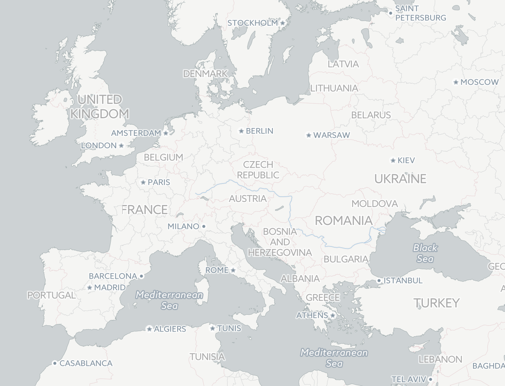

## Vector Data Source

*This is a work in progress towards OSM2VectorTiles v3.0*

This is the data source for the vector tile schema of OSM2VectorTiles.
It contains the *tm2source* project and the required database schema (views, functions).

The vector data sources stands as separate repository to foster collaboration with Wikipedia
and make it easier to fork the style without forking OSM2VectorTiles as well.

## Vision

The vector tile schema will contain the necessary features for creating a basemap.
We will orient ourselves on the cartography used in the [Carto Basemaps](https://carto.com/location-data-services/basemaps/).
Additional layers can be always be mixed in later on but we think OSM2VectorTiles should become less bloated in v3.0.



## Requirements

This vector tile schema depends on a database containing several different data sources
which need to be imported first. You can use your own ETL process or use the Docker containers from
OSM2VectorTiles.

Your PostGIS database needs the following data imported. If you use our Docker based workflow this is very straightforward to setup
but if you don't want to use Docker you can set up your own ETL pipeline to import the required data sources.

- [OpenStreetMap](http://wiki.openstreetmap.org/wiki/Osm2pgsql) data based on the [ClearTables osm2pgsql style](https://github.com/ClearTables/ClearTables)
- [OpenStreetMapData](http://openstreetmapdata.com/) split and simplified water polygons
- [Natural Earth](http://www.naturalearthdata.com/)
- [PostGIS Vector Tile Utils](https://github.com/mapbox/postgis-vt-util) for `LabelGrid` and `z` function

## Database Schema

The vector data source is using views, generalized tables and functions to share code between layers.
The SQL code can be found in `./schema`. The different features from OSM however are determined in the [ClearTables](https://github.com/ClearTables/ClearTables) project.

Each zoom level in a layer has it's own view where the data is *filtered* for the zoom level.
This keeps the filtering logic per zoom level out of the TM2Source `data.yml`.
To work on the database and vector tile schema read the *Develop* section.

## Develop

To work on *osm2vectortiles.tm2source* you need Docker and Python.

- Install [Docker](https://docs.docker.com/engine/installation/)
- Install [Docker Compose](https://docs.docker.com/compose/install/)
- Install [OpenMapTiles tools](https://github.com/openmaptiles/openmaptiles-tools) with `pip install openmaptiles-tools`

### Build

Build the tileset.

```
make
```

### Prepare the Database

Now start up the database container.

```bash
docker-compose up -d postgres`
```

Import water from [OpenStreetMapData](http://openstreetmapdata.com/).

```bash
docker-compose run import-water
```

Import [Natural Earth](http://www.naturalearthdata.com/) data.

```bash
docker-compose run import-natural-earth
```

Import [OpenStreetMap](http://wiki.openstreetmap.org/wiki/Osm2pgsql) data based on the [ClearTables osm2pgsql style](https://github.com/ClearTables/ClearTables).
In order to do this you first need to clone the latest ClearTables.

```bash
docker-compose run import-osm
```

### Work on Layers

Each time you modify layer SQL code run `make` and `docker-compose run import-sql`.

```
make
docker-compose run import-sql
```

To look at the vector tiles you can start up Mapbox Studio Classic in a container
and visit `localhost:3000` and open the vector source project under `/projects`.

```bash
docker-compose up mapbox-studio
```


## License

All code in this repository is under the [MIT license](./LICENSE) and the cartography decisions encoded in the schema and SQL is licensed under [CC0](https://creativecommons.org/publicdomain/zero/1.0/).
