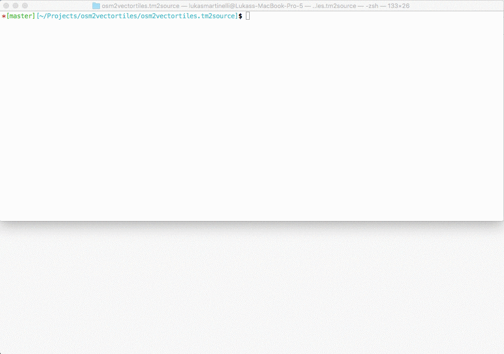

## OpenMapTiles

OpenMapTiles is a collection of vector tile layers you can mix and match to create your own vector tile sets
It is used by [OSM2VectorTiles](http://osm2vectortiles.org/) and we encourage you to collaborate, reuse and adapt existing layers
and add your own layers.

You define a self contained **Layer** together with SQL files and layer and data source definitions (like a imposm3 mapping file)
that you can then reference in a **Tileset** where you mix and match with other layers.

## Layers

### Standard Layers

OpenMapTiles contains a collection of Natural Earth and OSM based layers (with imposm3 mapping) you can modify and adapt.
We welcome new standard layers from other data sources or import tools (like osm2pgsql with ClearTables).

Each layer is documented and self contained. Click on the link for each layer to get more information.
Layers can be chosen to create a **Tileset** like the `openmaptiles.yaml` tileset.

- [boundary](layers/boundary/README.md)
- [building](layers/building/README.md)
- [highway](layers/highway/README.md)
- [highway_name](layers/highway_name/README.md)
- [housenumber](layers/housenumber/README.md)
- [landcover](layers/landcover/README.md)
- [landuse](layers/landuse/README.md)
- [place](layers/place/README.md)
- [poi](layers/poi/README.md)
- [railway](layers/railway/README.md)
- [water](layers/water/README.md)
- [water_name](layers/water_name/README.md)
- [waterway](layers/waterway/README.md)

### Define your own Layer

Take a look or copy a standard layer like [building](layers/building/README.md) to get started with your own layer.
A layer consists out of a **Layer** definition written in YAML format.

There you specify the `layer` proerties like `id`, `buffer_size` and possible Markdown documentation (`description` and `fields`).
You can also reference SQL files in `schema` for writing the necessary queries for your layer or create generalized tables.
We encourage you to have a function per layer which takes the bounding box and zoom level. This makes it easy
to test and reuse.

If your data is based of OSM you can also directly
reference a [imposm3 mapping file](https://imposm.org/docs/imposm3/latest/mapping.html) to choose the OSM data you need.

```yaml
layer:
  id: "building"
  description: Buildings from OpenStreetMap
  buffer_size: 4
  datasource:
    query: (SELECT geom FROM layer_building(!bbox!, z(!scale_denominator!))) AS t
  fields:
    render_height: An approximated height from levels and height of building.
schema:
  - ./building.sql
datasources:
  - type: imposm3
    mapping_file: ./mapping.yaml
```

### Define your own Tileset

A **Tileset** defines which layer will be in your vector tile set (`layers`)
and metadata used for generating a TM2Source project to actually generate the vector tiles.

```yaml
tileset:
  layers:
    - layers/building/building.yaml
    - layers/housenumber/housenumber.yaml
    - layers/poi/poi.yaml
  name: Street Level
  description: A tileset showing street level info like building, housenumbers and POIs.
  attribution: "OpenStreetMap contributors"
  maxzoom: 14
  minzoom: 13
  center: [-12.2168, 28.6135, 4]
```

## Develop

To work on OpenMapTiles you need Docker and Python.

- Install [Docker](https://docs.docker.com/engine/installation/)
- Install [Docker Compose](https://docs.docker.com/compose/install/)
- Install [OpenMapTiles tools](https://github.com/openmaptiles/openmaptiles-tools) with `pip install openmaptiles-tools`

### Build

Build the tileset.

```
# Build the imposm mapping, the tm2source project and collect all SQL scripts
make
# You can also run the build process inside a Docker container
docker run -v $(pwd):/tileset openmaptiles/openmaptiles-tools make
```

### Prepare the Database

Now start up the database container.

```bash
docker-compose up -d postgres`
```

Import water from [OpenStreetMapData](http://openstreetmapdata.com/).

```bash
docker-compose run import-water
```

Import [Natural Earth](http://www.naturalearthdata.com/) data.

```bash
docker-compose run import-natural-earth
```

Import [Lake center line](https://github.com/lukasmartinelli/osm-lakelines) data.

```bash
docker-compose run import-lakelines
```

Import [OpenStreetMap](http://wiki.openstreetmap.org/wiki/Osm2pgsql) data based on the [ClearTables osm2pgsql style](https://github.com/ClearTables/ClearTables).
In order to do this you first need to clone the latest ClearTables.

```bash
docker-compose run import-osm
```

### Work on Layers

Each time you modify layer SQL code run `make` and `docker-compose run import-sql`.

```
make clean && make && docker-compose run import-sql
```

Now you are ready to **generate the vector tiles**. Using environment variables
you can limit the bounding box and zoom levels of what you want to generate (`docker-compose.yml`).

```
docker-compose run generate-vectortiles
```

To look at the vector tiles you can start up Mapbox Studio Classic in a container
and visit `localhost:3000` and open the vector source project under `/projects`.

```bash
docker-compose up mapbox-studio
```



## License

All code in this repository is under the [MIT license](./LICENSE) and the cartography decisions encoded in the schema and SQL is licensed under [CC0](https://creativecommons.org/publicdomain/zero/1.0/).
