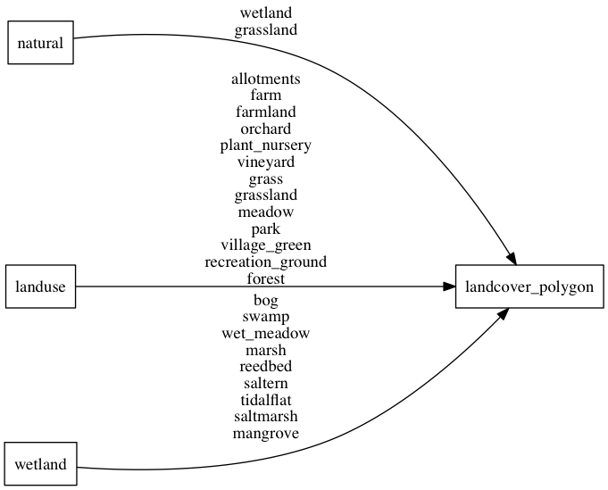

# landcover

Landcover is used to describe the physical material at the surface of the earth. At lower zoom levels this is
from Natural Earth data for glaciers and ice shelves and at higher zoom levels the landcover is implied
by OSM tags (like `landuse` or `natural`).

## Fields

- **class**: More generalized groups of either `farmland`, `ice`, `wood`, `grass` or `wetland`.
Use this to assign general colors to the landcover.
- **subclass**: Original value of either the `landuse`, `natural` or `wetland` tag.
Use this to do more precise styling.

## Mapping

