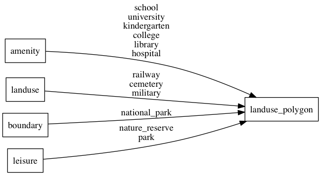

# landuse

Landuse is used to describe use of land by humans.At lower zoom levels this is
from Natural Earth data for residential (urban) areas and at higher zoom levels mostly OSM `landuse` tags.

## Fields

- **class**: More generalized groups of either `park`, `school`, `hospital`, `railway`,
`cemetery`, `military`, `residential`. Use this to assign general for landuse.
- **subclass**: Original value of either the `amenity`, `landuse`, `leisure` or `boundary` tag.
Use this to do more precise styling.

## Mapping

