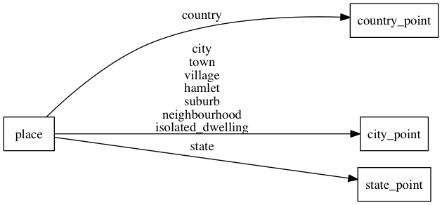

# place

The place layer consists out of [countries](http://wiki.openstreetmap.org/wiki/Tag:place%3Dcountry),
[states](http://wiki.openstreetmap.org/wiki/Tag:place%3Dstate) and [cities](http://wiki.openstreetmap.org/wiki/Key:place).
Apart from the roads this is also one of the more important layers to create a beautiful map.
We suggest you use different font styles and sizes to create a text hierarchy.

## Fields

- **name_en**: The english `name:en` value if available.
- **name**: The OSM [`name`](http://wiki.openstreetmap.org/wiki/Key:name) value of the POI.
- **rank**: Countries, states and the most important cities all have a `rank` to boost their importance on the map.
The `rank` field for counries and states ranges from `1` to `6` while the `rank` field for
cities ranges from `1` to `10`. Use the `rank` field to build a text hierarchy.
The rank value is a combination of the Natural Earth `scalerank`, `labelrank` and `datarank` values.
- **class**: Distinguish between `country`, `state` and other city classes like
`city`, `town`, `village`, `hamlet`, `suburb`, `neighbourhood` or `isolated_dwelling`.
Use this to separately style the different places according to their importance (usually country and state different
than cities).

## Mapping

