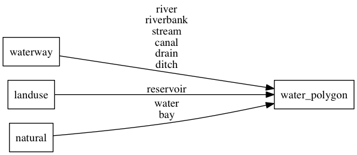

# water

Water polygons representing oceans and lakes. Covered watered areas are excluded (`covered=yes`).
Until z6 all water originates from Natural Earth. To get a more correct display of the south pole you should also
style the covering ice shelves over the water.
Water from OpenStreetMap after z7 is split into many smaller polygons to improve rendering performance.
This however can lead to less rendering options in clients since these boundaries show up. So you might not be
able to use border styling for ocean water features.

## Fields

- **class**: Either `ocean`, `lake` or `river`.

## Mapping

