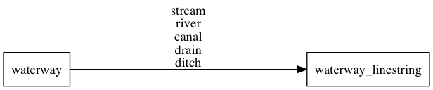

# waterway

Rivers based of OpenStreetMap [waterways](http://wiki.openstreetmap.org/wiki/Waterways) for *z8* to *z14*
and Natural Earth rivers and lake centerlines from *z3* to *z7*.
Too short linestrings are filtered out for some zoom levels. Waterways do no not have a `subclass`.

## Fields

- **name**: The OSM [`name`](http://wiki.openstreetmap.org/wiki/Key:name) value of the waterway or the name from Natural Earth for lower zoom levels.
- **class**: The original value of the [`waterway`](http://wiki.openstreetmap.org/wiki/Key:waterway) tag.
Can be one of [`stream`](http://wiki.openstreetmap.org/wiki/Tag:waterway%3Dstream),
[`river`](http://wiki.openstreetmap.org/wiki/Tag:waterway%3Driver),
[`canal`](http://wiki.openstreetmap.org/wiki/Tag:waterway%3Dcanal),
[`drain`](http://wiki.openstreetmap.org/wiki/Tag:waterway%3Ddrain),
[`ditch`](http://wiki.openstreetmap.org/wiki/Tag:waterway%3Dditch)`.

## Mapping

